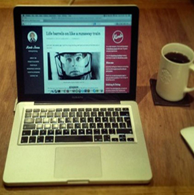

# windows_inspired
Windows 8.1 Inspired interactive web application that comes with some of the most distinct features on the operating system, including user's ability to change theme colors, backgrounds, update account picture and more. This could be great for a personal website,commercial advertising, blog etc.

# <h2>Features</h2>
<ul>
  <li>Windows 8.1 themed application</li>
  <li>Highly Customizable layout</li>
  <li>Large Pattern Library</li>
  <li>Responsive Interface</li>
  <li>Great cross-browser support, even in IE7+</li>
</ul>

# <h2>Get started</h2>

# <h3>Adding a new column with column class </h3>
            

                <a href="#" class="app md-app events">
                    Events                      
                </a> 
                
                    
                        
                        
                        
                    
                    &#160; A day in the life
                
            

<h3>Installation</h3>

Clone the repository

$ git clone git@github.com:ipeters90/windows_inspired.git

